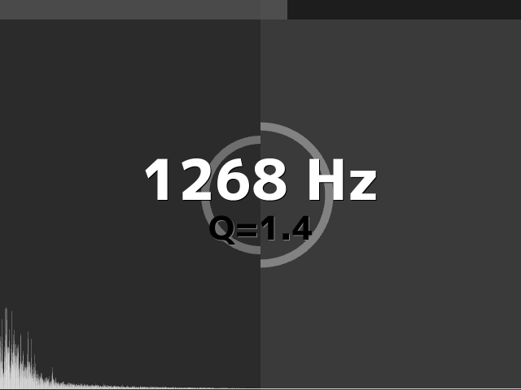

# realtime_filter

Siv3D Game Jam 第17回 テーマ「音楽アプリ」の投稿作品です．

音声データに対してリアルタイムにローパスフィルタを適用しながら再生します．

好きな音声ファイルをウィンドウにドラッグ＆ドロップしてみてください．

## スクリーンショット

## 動画
* <https://www.youtube.com/watch?v=fs1_sS7qdHo>

## 操作
* オーディオファイルのドロップ： ファイルの読み込み・再生
* Left / Right キー： カットオフ周波数の増減
* Down / Up キー： Q 値の増減
* Space キー： 再生／一時停止
* Enter キー： LPF / HPF の切り替え
* シークバー（画面上部）のクリック： シーク

## ダウンロード
* <https://github.com/voidproc/realtime_filter/releases/download/v1.0/realtime_filter.zip> (x86版)

## 参考
* <http://www.musicdsp.org/files/Audio-EQ-Cookbook.txt>
